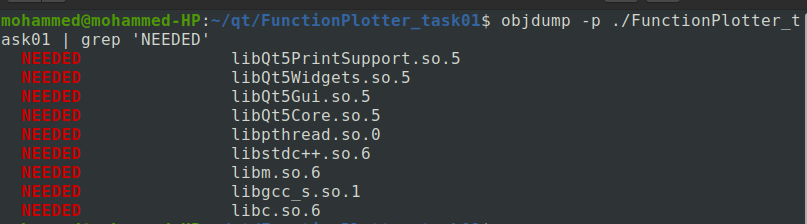
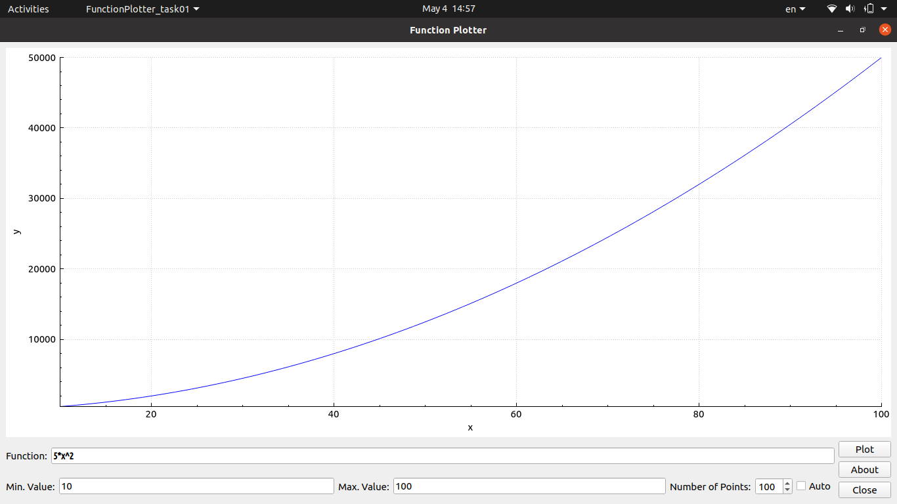
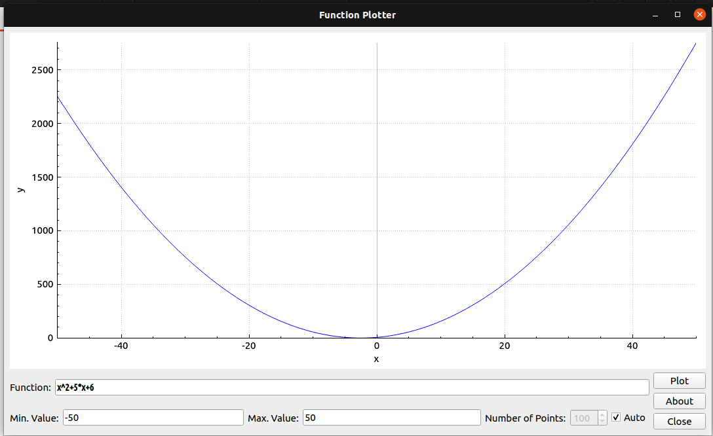
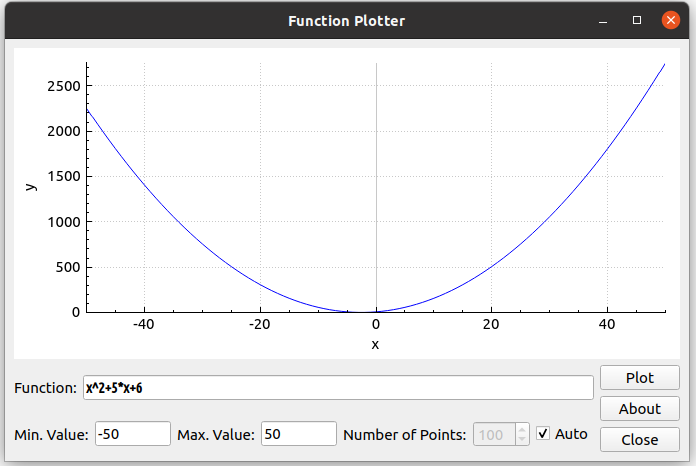
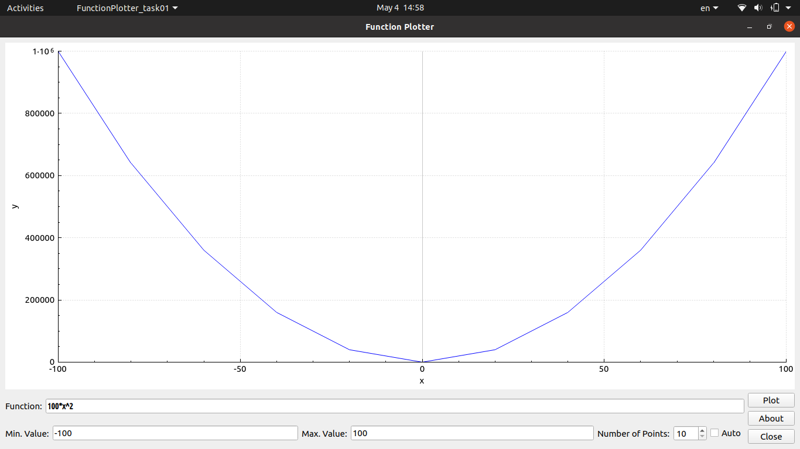
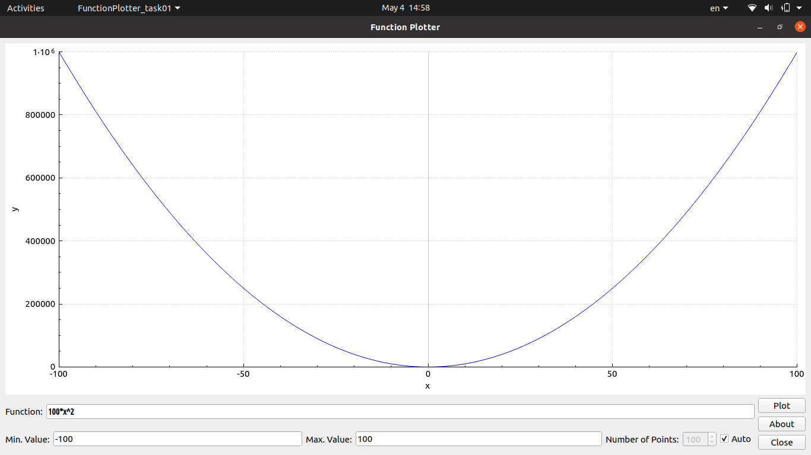
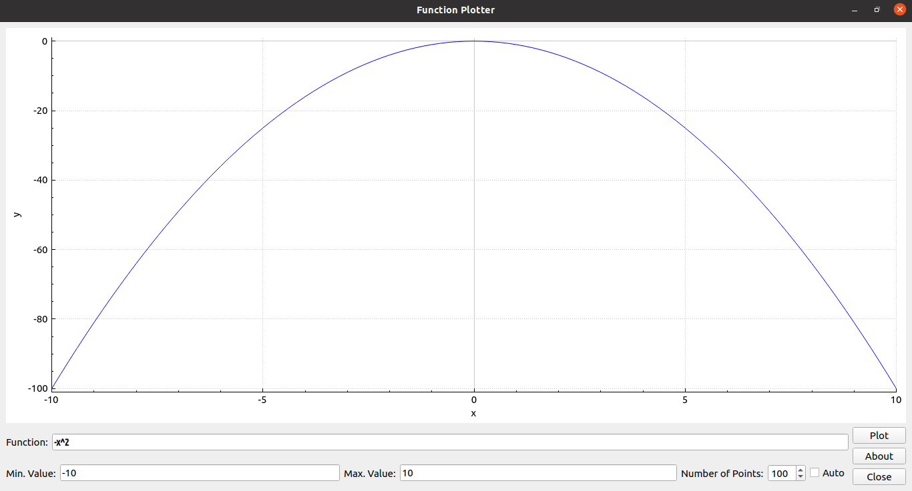
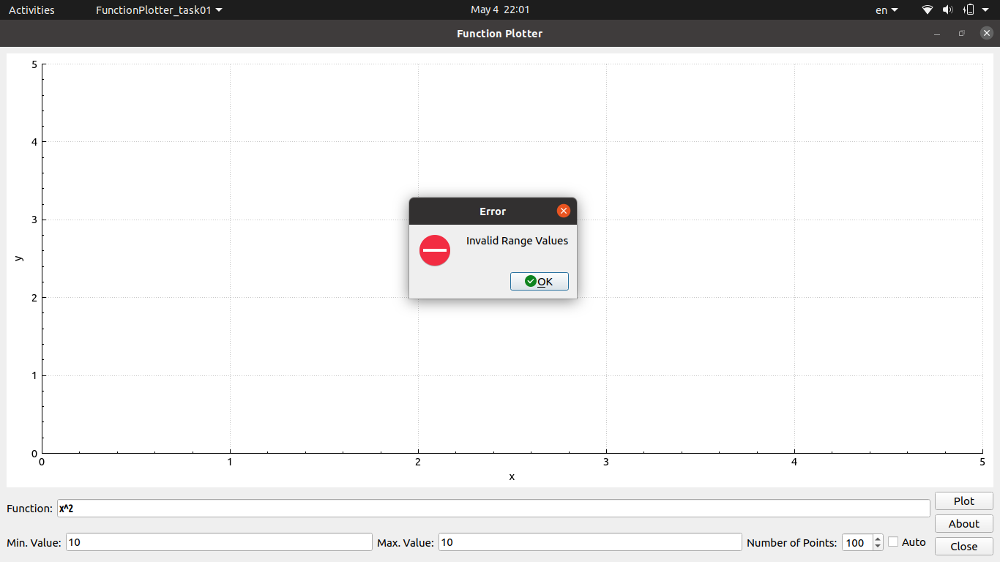
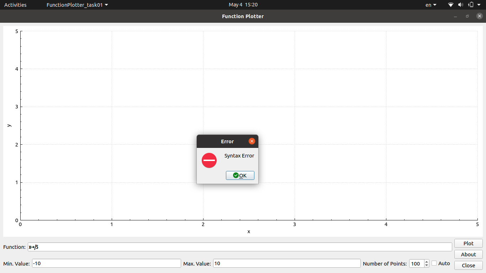

# FunctionPlotter_Task03

## Overview
An application that plot functions created using Qt Creator and C++.

## Features
- Support Basic Operations + - * / ^.
- Support decimal numbers.
- Support Manual Set x ranges.
- Automatic scaling of y axis.
- Flexible window
- Parentheses are not supported yet.
- Trigonometric functions also are not supported.

## General Info.
- C++ language.
- Qt Creator
- [QCustomPlot] (3d-party lib)

## How it works
##### The magic begins after pressing Plot button. 
##### Validation Step:
It make sure the range values are numbers (integer/decimal) and they are not equal, otherwise it displays error message. After that it make sure that the syntax is correct. Look at the following cases of two adjacent characters:
> Number - Number : Considered as one number of two digit. (eg. "25")
> Number - x (variable) : Invalid syntax. (eg. "2x")
> Number - Operator : Valid syntax. (eg. "2+")
> x (variable) - Number : Invalid syntax. (eg. "x2")
> x (variable) - x (variable) : Invalid syntax. (eg. "xx")
> x (variable) - Operator : Valid syntax. (eg. "x-")
> Operator - Number : Valid syntax. (eg. "-5")
> Operator - x (variable) : Valid syntax. (eg. "/x")
> Operator - Operator : Invalid syntax. (eg. "*/")

After that it checks the last character. If it is an operator it will display the error message.
```cpp
bool MainWindow::validateExpression(const char * expressionString, size_t len)
{
    int numberOfOperands = 0;
    int numberOfOperations = 0;
    char prevChar = expressionString[0];

    // Check whether the first element is a Number/Variable, add/subrract operation or otherwise
    if(ExpressionParser::isNumber(expressionString[0]) || ExpressionParser::isVariable(expressionString[0])) {
        numberOfOperands++;
    }
    else if(expressionString[0] == '+' || expressionString[0] == '-') {
        numberOfOperations++;
    }
    else {
        // Invalid begining character
        return false;
    }

    // Test the sequence (Previous Character - Current Character)
    for(size_t i = 1; i < len; i++) {
        if(ExpressionParser::isNumber(expressionString[i])) {
            if(ExpressionParser::isNumber(prevChar)) {
                // Number - Number
            }
            else if(ExpressionParser::isOperator(prevChar)) {
                // Operator - Number
                numberOfOperands++;
            }
            else {
                // Variable - Number
                // Otherwise - Number
                return false;
            }
        }
        else if(ExpressionParser::isOperator(expressionString[i])) {
            if(i == len - 1)
            {
                return false;
            }
            else if(ExpressionParser::isNumber(prevChar)) {
                // Number - Operator
                numberOfOperations++;
            }
            else if(ExpressionParser::isVariable(prevChar)) {
                // Variable - Operator
                numberOfOperations++;
            }
            else {
                // Operator - Operator
                // Otherwise - Operator
                return false;
            }
        }
        else if(ExpressionParser::isVariable(expressionString[i])) {
            if(ExpressionParser::isOperator(prevChar)) {
                // Operator - Variable
                numberOfOperands++;
            }
            else {
                // Number - Variable
                // Variable - Variable
                // Otherwise - Variable
                return false;
            }
        }
        else {
            return false;
        }

        // Update previous character
        prevChar = expressionString[i];
    }

    // Check whether the number of operations > the number of operands
    if(numberOfOperands < numberOfOperations)
    {
        return false;
    }

    return true;
}
```
##### Parsing Step:
After validation, it will make and object of ==**ExpressionParser**== class. The object parse the string and save it as a vector of nodes.  Each node contains a type (constant, var, add, subtract, ...) and a value. The value represent the double-type number. This make the parsing operation to be done only one time.

```cpp
    // Enum that represent the type of the node (variable, constant, operation)
    enum Node_Type {constant, var, add, subtract, multiply, divide, power};

    // Represent a variable, constant or operation
    typedef struct node_struct {
        Node_Type type;
        double value;
    } Node;

    // Vector to store the result of parsed string
    std::vector<Node> parsedExpressionVector;
```
##### Generate a vector of points and plot it:
After that The range of x is devided into a vector of points. For each of these points we must calculate the corresponding y value. Here we can see the advantage of using the **Node** structure. We will perform the calculations many times. And it will help us to aviod reparsing the string again and again. Also we can find the value of the constants in ==**double value;**== member of the structure.

Now, We can plot the points easily. 🙂

## Executable File Dependencies



## How to use
Simply after running the executable file you should write the function in the function field and write the ranges of input then press (Plot).
> Note : you must use the operators mentioned above. Don't forget to add * operator between number and variable (eg. 3*x).

## Project Files
> ### Source Files
> - main.cpp : Entry point that call the Qt Application.
> - mainwindow.cpp : Contain the events of the GUI.
> - expressionParser.cpp : Parse the function string.
> - qcustomplot.cpp : 3d-party library that plot a series of points represented by x and y vectors.
> ### Header Files
> - expressionParser.h
> - mainwindow.h
> - qcustomplot.h
> ### Other Files
> - FunctionPlotter_task01.pro
> - mainwindow.ui

## Testing & Screenshots
### Some valid examples:
Example



Window is resizable


The effect of changing the number of points
 

The function can start with negative sign


### Some invalid examples:
Invalid range values


Syntax Error
 
 


[QCustomPlot]: <https://www.qcustomplot.com>

